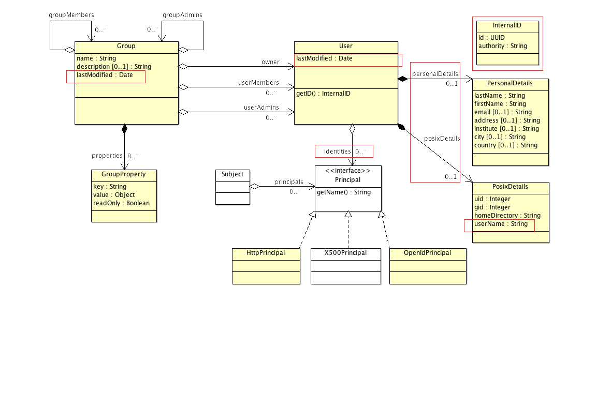

# cadcAccessControl

## Description

The cadcAccessControl module contains the shared model classes and exceptions used by the access control clients and
server. It also contains the UserClient and GMSClient (group management service client).

## Object Model

The CADC User Authorization Model is a model for representing users and groups.

In the system, a user is uniquely identified by one Principal (e.g. NumericPrincipal) but can have a number of other
identities for different contexts:

- HttpPrincipal: Web user identity associated with Simple HHTP User Password access.
- X500Principal: X509 certificate identity.
- NumericPrincipal: An numeric identity associated with a user. Typically, used internally within a system.
- OpenIdPrincipal: An OpenID identity.

Groups represet associations of users. Groups have an owner, administive members, and actual members. Members can be
groups or users.

